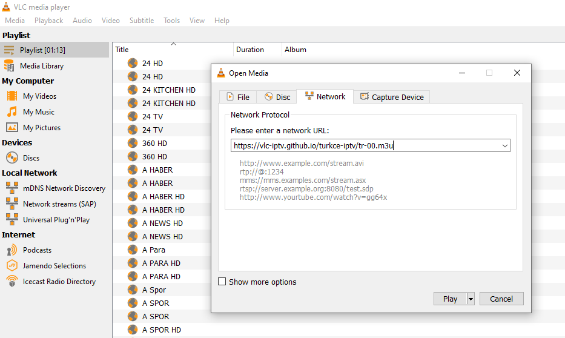

#  Türkçe İPTV Listeleri
> Tüm dünya geneli 8000+ IPTV kanal listesine https://github.com/iptv-org/iptv reposundan ulaşabilirsiniz.

## Kullanım
Türkçe IPTV televizyon kanallarını izlemek için VLC Player gibi M3U destekli bir Media Player kullanmalısınız. Aşağıdaki linkleri Player'ınıza yapıştırarak kanalları izleyebilirsiniz.

* https://vlc-iptv.github.io/tr-00.m3u  
* https://vlc-iptv.github.io/tr-01.m3u
* https://vlc-iptv.github.io/tr-02.m3u
* https://vlc-iptv.github.io/tr-03.m3u
* https://vlc-iptv.github.io/tr-04.m3u
* https://vlc-iptv.github.io/tr-05.m3u
* https://vlc-iptv.github.io/tr-06.m3u
* https://vlc-iptv.github.io/tr-07.m3u
* https://vlc-iptv.github.io/tr-08.m3u

